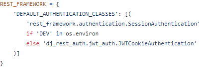

# Deployment

## Table of Contents

### Setting up a basic Django project and deploying to Heroku

-   [**Deployment**](#deployment)
    -   [**Initial Deployment**](#initial-deployment)
    -   [**Create Repository**](#create-repository)
    -   [**Setting up the Workspace**](#setting-up-the-workspace)
    -   [**Set Up JWT Tokens**](#set-up-jwt-tokens)
    -   [**Prepare API for deployment to Heroku**](#prepare-api-for-deployment-to-Heroku)
    -   [**Deploy to ElephantSQL**](#deploy-to-elephantsql)
    -   [**Create a Heroku app**](#create-a-heroku-app)
    -   [**Confirming your migrations**](#confirming-your-migrations)
    -   [**Prepare the project for deployment**](#prepare-the-project-for-deployment)
    -   [**Deploying to Heroku**](#deploying-to-heroku)
    -   [**dj-rest-auth Bug Fix for logging out**](#dj-rest-auth-bug-fix-for-logging-out)
    -   [**Add ALLOWED_HOSTS and CLIENT_ORIGIN_DEV**](#add-allowed_hosts-and-client_origin_dev)

## Initial Deployment

Early deployment is key, so this was one of the very first steps I tackled. By deploying to heroku early I knew future complications were less likely.

### Create Repository

* Use the [Code Institute Template](https://github.com/Code-Institute-Org/gitpod-full-template) to create a new repository on GitHub.

### Setting up the Workspace

* Open a the workspace and use the terminal to install Django with the command **pip3 install 'django<4'**

* Initialize the project with the command **django-admin startproject your_project_name .** In my case I used **django-admin startproject brick_connect_api .**

* Install Django Cloudinary storage for image storage with the command **pip install django-cloudinary-storage**

* Install Pillow for image processing capability with the command **pip install Pillow**

* Add 'cloudinary' and 'cloudinary_storage' to 'INSTALLED_APPS' in settings.py being sure to have 'django.contrib.staticfiles' between them. See INSTALLED_APPS below: 

* Create an env.py file in the base directory and add **import os** at the top, then add the Cloudinary API Environment variable, example below:

os.environ['CLOUDINARY_URL'] = 'Cloudinary API Environment variable'

The Cloudinary API Environment variable can befound in 'Account Details' in your cloudinary account.

* Back in settings.py
    * add import os and env.py (if it is present) under the **from pathlib import Path** line
    * set CLOUDINARY_STORAGE to the CLOUDINARY_URL
    * set MEDIA_URL so the settings knows where to put the image files
    * set the DEFAULT_FILE_STORAGE to cloudinary_storage.storage.MediaCloudinaryStorage

See image below:

## Set Up JWT Tokens

* Install JSON Web Token authentication by running the command **pip3 install dj-rest-auth==2.1.9** in the terminal

* Add 'rest_framework.authtoken' and 'dj_rest_auth' to the list of INSTALLED_APPS in settings.py, see image below:

* Add the dj-rest-auth to the urlpatterns in the main urls.py file, see below:

* Run migrations in the terminal with the command **python manage.py migrate**

* For users to be able to register, install Django AllAuth by running the comman **pip install 'dj-rest-auth[with_social]'** in the terminal

* Add the following INSTALLED_APPS to settings.py, see below:

* Set SITE_ID in settings.py to 1, like this **SITE_ID = 1**

* Add the registration urls to the main urls.py file, see below:

* To install the JSON tokens, run **pip install djangorestframework-simplejwt** in the terminal

* Set DEV to 1 in the env.py file, like this **os.environ['DEV'] = '1'**

* Use the DEV value to check if we are in Development or Production. Add the following code in the settings.py file, see image below:

* To enable token authentication, set 'REST_USE_JWT = True'
* To make sure tokens are sent over HTTPS only, set 'JWT_AUTH_SECURE = True'
* Cookie names also need to be declared:
    * JWT_AUTH_COOKIE = 'my-app-auth'
    * JWT_AUTH_REFRESH_COOKIE = 'my-refresh-token'
The final code should look like the image below and be just under the if/else statement from the previous step.

* Create serializers.py file in the main app directory, and copy and paste UserDetailsSerializer code from Django documentation, see image below:

* Overwrite the default user detail serializer in settings.py, see below image:

* Migrate the database again by running the command **python manage.py migrate** in the terminal.

* Update requirements.txt file with new dependencies by running command **pip freeze > requirements.txt**

* Add, commit and push all changes to GitHub

## Prepare API for deployment to Heroku

* Create a views.py file in the main directory and add the following code to add a custom message to the root_route, see image below:

The message can be personal to you, mine was **"message": "Welcome to my brick connect API!"**

* Import it into the main urls.py file, and add the url for root_route to the top of the list, see image below:

* To set up page pagination, inside settings.py add the following to REST_FRAMEWORK, see image below:

* Set the default renderer to JSON for the production environment. In settings.py, see image below: 

* To set up DATETIME_FORMAT, specify the DATETIME_FORMAT in REST_FRAMEWORK and set it to, see image below: 

* To show how long ago a comment was created, set DATETIME format inside the serializers.py file within the comments app, see code below:

from django.contrib.humanize.templatetags.humanize import naturaltime

created_on = serializers.SerializerMethodField()
updated_on = serializers.SerializerMethodField()

    def get_created_on(self, obj):
        return naturaltime(obj.created_on)

    def get_updated_on(self, obj):
        return naturaltime(obj.updated_on)

* Add, commit and push all changes to GitHub

## Deploy to ElephantSQL

* Log into ElephantSQL and create a new instance

* Select the free plan

* Select a region closest to you

* Click review

* Click on 'Create Instance'

* Return to the dashboard and click on the instance you just created

* In the URL section, click the copy icon to copy the database URL

## Create a Heroku app

* Log into Heroku

* Create a new app

* Open the Settings tab, add a Config Var DATABASE_URL, and for the value, copy in your database URL from ElephantSQL (do not add quotation marks)

* Go back to your IDE

* In the terminal, install dj_database_url and psycopg2, both of these are needed to connect to your external database use commend **pip3 install dj_database_url==0.5.0 psycopg2**

* In your settings.py file, import dj_database_url underneath the import for os: **import dj_database_url**

* Update the DATABASES section to the following, see image below:

This will ensure that when you have an environment variable for DEV in your environment the code will connect to the sqlite database here in your IDE. Otherwise it will connect to your external database, provided the DATABASE_URL environment variable exist.

* In your env.py file, add a new environment variable with the key set to DATABASE_URL, and the value to your ElephantSQL database URL
**os.environ['DATABASE_URL'] = "<your PostgreSQL URL here>"**
Remember to add quotes as this needs to be a string.

* Temporarily comment out the DEV environment variable so that your IDE can connect to your external database, see image below:

* Back in your settings.py file, add a print statement to confirm you have connected to the external database, see image below:

* In the terminal, -–dry-run your makemigrations to confirm you are connected to the external database, using the command **python3 manage.py makemigrations --dry-run**

* If you are, you should see the ‘connected’ message printed to the terminal

* Remove the print statement

* Migrate your database models to your new database, with command: **python3 manage.py migrate**

* Create a superuser for your new database using command: **python3 manage.py createsuperuser**

## Confirming the migrations

* On the ElephantSQL page for your database, in the left side navigation, select “BROWSER”

* Click the Table queries button, select auth_user

* When you click “Execute”, you should see your newly created superuser details displayed. This confirms your tables have been created and you can add data to your database

## Prepare the project for deployment

* In the terminal of your IDE workspace, install gunicorn with command: **pip3 install gunicorn django-cors-headers**

* Update your requirements.txt using command: **pip freeze --local > requirements.txt**

* Heroku also requires a Procfile. Create this file now. Remember, it must be named correctly and not have any file extension, otherwise Heroku won’t recognise it.

* Inside the Procfile, add these two commands:
    * **release: python manage.py makemigrations && python manage.py migrate**
    * **web: gunicorn brick_connect_api.wsgi** This needs to be your API file name.
Dont forget to save the file

* In your settings.py file, update the value of the ALLOWED_HOSTS variable to include your Heroku app’s URL, see image below:

* Add corsheaders to INSTALLED_APPS, see image below:

* Add corsheaders middleware to the TOP of the MIDDLEWARE, see image below:

* Under the MIDDLEWARE list, set the ALLOWED_ORIGINS for the network requests made to the server with the following code, see image below:

Here the allowed origins are set for the network requests made to the server. The API will use the CLIENT_ORIGIN variable, which is the front end app's url. We haven't deployed that project yet, but that's ok. If the variable is not present, that means the project is still in development, so then the regular expression in the else statement will allow requests that are coming from your IDE.

* Enable sending cookies in cross-origin requests so that users can get authentication functionality, see image below:

* To be able to have the front end app and the API deployed to different platforms, set the JWT_AUTH_SAMESITE attribute to 'None'. Without this the cookies would be blocked, see image below:

* Remove the value for SECRET_KEY and replace with the following code to use an environment variable instead, see image below:

* Set a NEW value for your SECRET_KEY environment variable in env.py, do NOT use the same one that has been published to GitHub in your commits, see image below:

* Set the DEBUG value to be True only if the DEV environment variable exists. This will mean it is True in development, and False in production, see image below: 

* Comment DEV back in env.py, see image below:

* Ensure the project requirements.txt file is up to date. In the IDE terminal of your API project enter the following **pip freeze --local > requirements.txt**

* Add, commit and push all changes to GitHub

## Deploying to Heroku

* Back on the Heroku dashboard for your new app, open the Settings tab

* Add two more Config Vars:
    * SECRET_KEY (you can make one up, but don’t use the one that was originally in the settings.py file!)
    * CLOUDINARY_URL, and for the value, copy in your Cloudinary URL from your env.py file (do not add quotation marks!)
    * DATABASE_URL should already be your 'postgress' link
    * DISABLE_COLLECTSTATIC should already be set to 1

* Open the Deploy tab

* In the Deployment method section, select Connect to GitHub

* Search for your repo and click Connect

* Optional: You can click Enable Automatic Deploys in case you make any further changes to the project. This will trigger any time code is pushed to your GitHub repository

* Locate 'Manual Deploy' and click 'Deploy Branch'

* Your app should be up and running now, so click the Open app button

* If there was an error click the 'More' button at the top next to 'Open app' and click 'view logs'.

* Check that your program has deployed, you should see the JSON welcome message from the home screen,

This is the message we created earlier when rendering the 'Root Route **"message": "Welcome to my brick connect API!"**

## dj-rest-auth Bug Fix for logging out

* In your api/views.py, import JWT_AUTH settings from settings.py,see image below:

*  Write a logout view. Here we are setting the value of both the access token (JWT_AUTH_COOKIE) and refresh token (JWT_AUTH_REFRESH_COOKIE) to empty strings. We also pass samesite=JWT_AUTH_SAMESITE, which we set to ’None’ in settings.py and make sure the cookies are httponly and sent over HTTPS, see image below:

* Now that the logout view is there, it has to be included in your api/urls.py . The logout_route also needs to be imported is **from .views import route_route, logout_route**

* ... and then included in the urlpatterns list. The important thing to note here is that our logout_route has to be placed above the default dj-rest-auth urls, so that it is matched first, see image below

* Add, commit and push all changes to GitHub

* Return to Heroku, in the Deploy tab, Manually Deploy your code again

## Add ALLOWED_HOSTS and CLIENT_ORIGIN_DEV

* In settings.py, in the ALLOWED_HOSTS list, copy your ‘... .herokuapp.com’ string

* Log in to heroku.com and select your API application

* Click “settings

* Click “Reveal config vars”

* Add the new key of ALLOWED_HOST with the value for your deployed Heroku application URL that we copied from settings.py

* Back in settings.py, replace your ALLOWED HOSTS list '... .herokuapp.com' string we just copied with the ALLOWED_HOST environment variable, see image below:

In order to make our application more secure and accommodate the way Gitpod works by changing the workspace URL regularly, the below code has been provided for you to add to your project.

* The following code works as follows:
    * When the CLIENT_ORIGIN_DEV environment variable is defined, the unique part of your gitpod preview URL is extracted.
    * It is then included in the regular expression provided by us so that the gitpod workspace is still connected to our API when gitpod rotates the workspace URL.

* Import the regular expression module at the top of your settings.py file. We will need this to manipulate the CLIENT_ORIGIN_DEV URL string.
**import re**

* Replace the else statement and body for if 'CLIENT_ORIGIN' in os.environ: with the following code, see image below:

* Add, commit and push all changes to GitHub

* Return to your Heroku application for this API project

* Click on the “Deploy” tab

* Scroll down and click “Deploy branch”