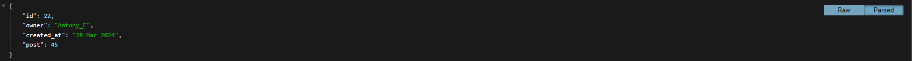

# **Brick Connect**

## **API Overview**

The creation of Brick Connect API arose from a genuine aspiration to unite the LEGO community within a secure and welcoming environment. Its primary aim is to provide users with a dedicated platform to showcase their distinctive LEGO creations, fostering a spirit of collaboration and creativity among enthusiasts. By seamlessly integrating with the front-end ReactJS, the API ensures smooth functionality, enhancing the user experience. Through Brick Connect, users can explore a vast amount of LEGO builds shared by others, follow their LEGO adventures, and actively engage in creating, updating, and deleting their own posts, thereby cultivating an interactive and dynamic community space centered around a shared passion for LEGO craftsmanship.

## Table of contents:
1. [**Site Overview**](#site-overview)
1. [**Planning stage**](#planning-stage)
    * [**Strategy**](#strategy)
      * [***Site Aims***](#site-aims)
      * [***User Stories***](#user-stories)
    * [***Wireframes***](#wireframes)
    * [***Database Schema***](#database-schema)
1. [**Agile Development**](#agile-development)
1. [**Features**](#features)
    * [***Admin Page***](#admin-page)
    * [***Posts***](#posts)
    * [***Comments***](#comments)
    * [***Likes***](#likes)
    * [***CommentLike***](#commentlike)
    * [***Favourites***](#Favourites)
    * [***Followers***](#followers)
    * [***Notifications***](#notification)
    * [***Defensive Design***](#defensive-design)
    * [***User Authentication***](#user-authentication)
    * [***404 Page***](#404-page)
1. [**Future-Enhancements**](#future-enhancements)
1. [**Testing Phase**](#testing-phase)
1. [**Deployment**](#deployment)
1. [**Technologies Used**](#technologies-used)
1. [**Media**](#media)
1. [**Credits**](#credits)
1. [**Honourable mentions**](#honourable-mentions)

## **Planning Stage**

### **API Aims:**

* Provide the back-end component to a front-end site developed with React.js.
* To assist the user in registering, logging in and logging out on the front-end.
* To provide front-end users with CRUD (create, read, update and delete) functionality for posts found on the site.
* To allow users on the front-end to create, edit and delete their own comments and delete their own.
* To give users the ability to follow and unfollow fellow users of the site.
* To allow for greater community interaction by giving users the opportunity to like or remove the like from posts.
* Provide filtered content for the front-end user based on whether they follow a user or have liked or favourited a particular post.
* Enhance the user experience integrated search function for those trying to find a specific user or post.
* Offer users the opportunity to provide more information about themselves by adding to their user profile. 

### **User Stories:**

### User stories specific to this API are listed below:

#### **Site User**

As a **Registered** User I can:
* I can **update my username and password** so that **update my display name and keep my profile secure**
* I can **edit my profile** so that **I can update my information**
* I can **like a comment** so that **I can express myself without having to make a comment**
* I can **edit the comment** so that **I can fix or update the comment**
* I can **create a comment on a post** so that **I can share my thoughts about the post**
* I can **edit my post title, description and change the image** so that **my post can be corrected or updated after it was posted**
* I can **like or remove my like from a post** so that **I can express my liking of the post or remove the like if I choose to do so**
* I can **create posts** so that **I can share my images with the rest of the community**
* I can **sign in to the site** so that **I can gain full access to the site**
* I can **log out of my profile** so that **I can keep my profile secure**

As an **Unregistered** User I can:
* I can **create a new account** so that **I can access the full sights features**

### **Wireframes**

Wireframes are not required for the API part of this project. Wireframes can be found in the [README](https://github.com/Antonyeaster/brick-connect-react/blob/main/README.md) for the frontend.

### **Database Schema**

I used [dbdiagram](https://dbdiagram.io/home) to help build my database tables. The image below shows the diagram.

## Agile Development

I used Github projects to create and track issues and User Stories. The Agile processes and methodologies can be viewed [here](/AGILE.md)

 

# **Features**

## **API Navigation**

### **Admin Page**

The admin page displays each individual part of my project. Within these different areas, I can trigger changes to be made, which are then reflected in the Django Rest Framework Browser. This has been very important for testing different parts of my API are working.

### **Posts**

The posts list page shows a list of posts that have been created within the Django admin panel and a separate screen shot of the posts created on the front end, which is displayed from the Heroku deployed API. This is because the development version and deployed versions run on different databases but do the same thing.

Individual posts can also be viewed with an id number in the URL.

### **Comments**

Users can comment on posts, and the comment gets added to individual posts. Screenshots below display the development and deployed versions.

Individual comments can also be viewed with an id number in the URL.

### **Likes**

Likes can be added to posts and users have the option to like and unlike a post in the front end. This is effectivly adding a like and deleting a like. A filter allows for the liked posts to be displayed in a liked feed on the front end. Screenshots below display the development and deployed versions.

Individual likes can also be viewed with an id number in the URL.

### **CommentLike**

CommentLike can be added to comments and users have the option to like and unlike a comment in the front end. This is effectivly adding a like and deleting a like. Screenshots below display the development and deployed versions.

Individual likes on comments can also be viewed with an id number in the URL.

### **Favourites**

Favourites can be added to posts and users have the option to favourite and remove favourites from posts in the front end. This is effectivly adding a favourite and deleting a favourite. A filter allows for the favourited posts to be displayed in a favourited feed on the front end. Screenshots below display the development and deployed versions.

Individual favourites can also be viewed with an id number in the URL.

### **Followers**

The users have the ability to follow and unfollow other users. This is effectivly the same as adding a follow and then deleting it. Screenshots below display the development and deployed versions.

Individual followers can also be viewed with an id number in the URL.

**Notifications**

When users comment on a post or follow another user they trigger a notification to be sent to the specific user the post belongs to or the user they have followed. Notifications are automatically created using signals. Screenshots below display the development and deployed versions.

Individual notifications can also be viewed with an id number in the URL.

## **Defensive Design**
### **Permissions**

Permission are set across the site, with the intention to keep users out of areas that do not belong to their profile. These include:

* Editing or deleting a post that is nto owned
* Editing or deleting a comment that is not owned
* Editing a profile that is not owned
* Viewing notifications that are not owned
* Creating likes without being signed in
* Creating favourites without being signed in
* Creating comments without being signed in
* Creating comments likes without being signed in

### User Authentication

User authentication is present on the front-end and Users are unable to access any site content unless they are logged in.

### **404 Page**

A custom 404 page has been created and renders on the front end following an invalid URL.

## **Future-Enhancements**

There are quite a few future enhancements I'd like to feature in a later development of this site. However, due to the nature of the course and having a deadline coming up quickly, it was more sensible to make note of these and come back to them.

Enhancements include:

* Posting videos (timelapse of peoples builds)

* A more refined notification system - Meaning the user to provide their email on sign up and get email notifications

* Notification indication from the navbar

* Direct profile link to the user that just followed you

* A sharing system, so users can share a post they really like with other users

* Popular Posts - to show what posts are trending at the current time

## **Testing Phase**

The testing process, along with bugs, can be viewed [here](TESTING.md)​

## **Deployment**

## **Technologies Used**

### Languages

* Python

### Frameworks, Libraries and Programs

* [Django Rest Framework](https://www.django-rest-framework.org/)
* [Pillow](https://pypi.org/project/pillow/) for image processing
* [Django Rest Auth](https://www.django-rest-framework.org/api-guide/authentication/) to handle authentication
* [Django allauth](https://docs.allauth.org/en/latest/) to handle authentication
* [Cors Headers](https://github.com/adamchainz/django-cors-headers) Cross Origin Resource
* [Gunicorn](https://pypi.org/project/gunicorn/) Python WSGI HTTP server
* [dbdiagrams](https://dbdiagram.io/home) to create the logic for the project
* [Psycopg2](https://pypi.org/project/psycopg2/) Python PostgreSQL database adapter

* [Cloudinary](https://cloudinary.com/) to handle static images
* [Gitpod](https://www.gitpod.io/) to create, load and push my code to GitHub
* [GitHub](https://github.com/home?ef_id=_k_Cj0KCQjwqpSwBhClARIsADlZ_Tm8cXuoED2r24fakY1kqXeptQcrc2ncHiUqOaa_vuLGhA6w5nZTWXUaAr6CEALw_wcB_k_&OCID=AIDcmm153qff2f_SEM__k_Cj0KCQjwqpSwBhClARIsADlZ_Tm8cXuoED2r24fakY1kqXeptQcrc2ncHiUqOaa_vuLGhA6w5nZTWXUaAr6CEALw_wcB_k_&gad_source=1&gclid=Cj0KCQjwqpSwBhClARIsADlZ_Tm8cXuoED2r24fakY1kqXeptQcrc2ncHiUqOaa_vuLGhA6w5nZTWXUaAr6CEALw_wcB) to create and store my repository for this project
* [ElephantSQL](https://www.elephantsql.com/) to handle postgreSQL database
* [Heroku](https://www.heroku.com/) For project deployment

A full list of requirements and the versions can be found [here](requirements.txt)

## **Credits**

* The DRF-API walk through supplied by Code Institute was followed for inspiration and reference during the process of this project.

### Code Help

* For help with 'naturaltime' in my serializers I used this [Stackoverflow](https://stackoverflow.com/questions/70952799/how-to-use-django-contrib-humanize-filter-in-drf-serializers)

* [Django Rest Framework](https://www.django-rest-framework.org/) This was too used across the build of the backend API
Other sources include:

* Code Institute LMS
* [Geek for Geeks](https://www.geeksforgeeks.org/)
* [Cloudinary](https://cloudinary.com/documentation)

## Media

The default profile image Code Institute provided was used as the default profile image for my project

## Honourable mentions

* A huge thank you to my mentor, Richard Wells. Richard's been brilliant at giving help and feedback as well as keeping a calm head on the whole project.
* The community on the Code Institute Slack channel has always generally come across the same problems at some point, and someone is always around to lend a helping hand.
* The tutor support team at Code Institute has been a huge help with any particular problems I've come across.
* A general thanks to my family and friends who have always been patient with me when I need a quiet place to work.