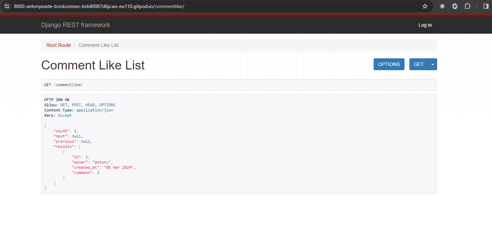
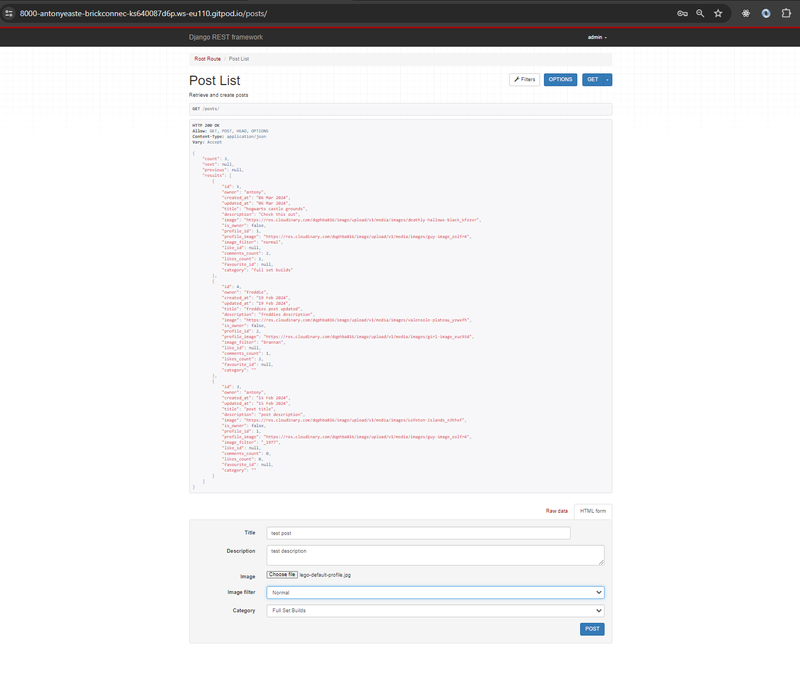
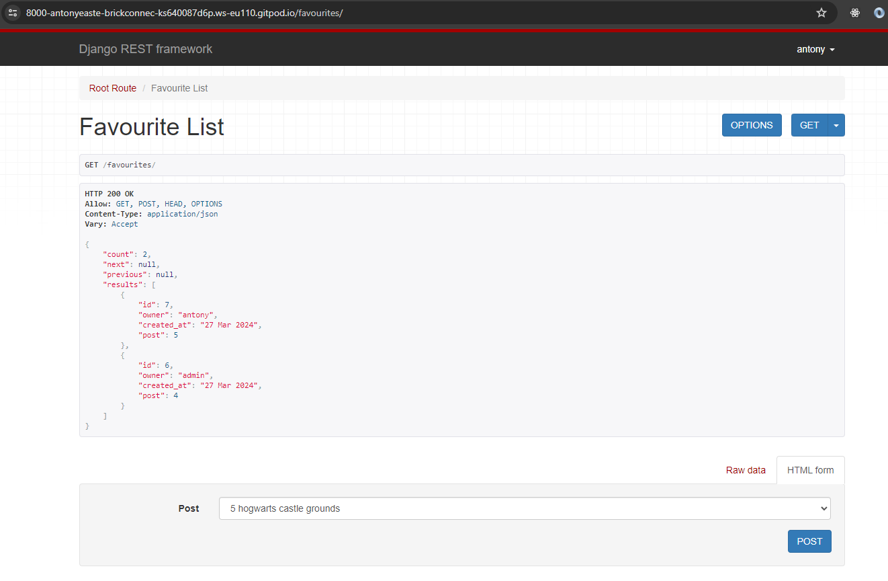
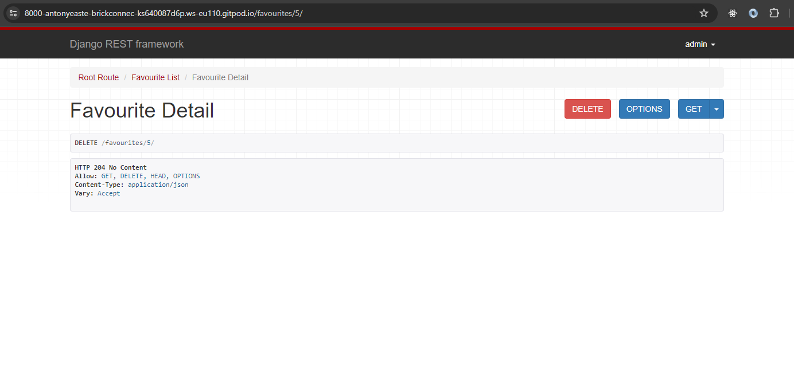
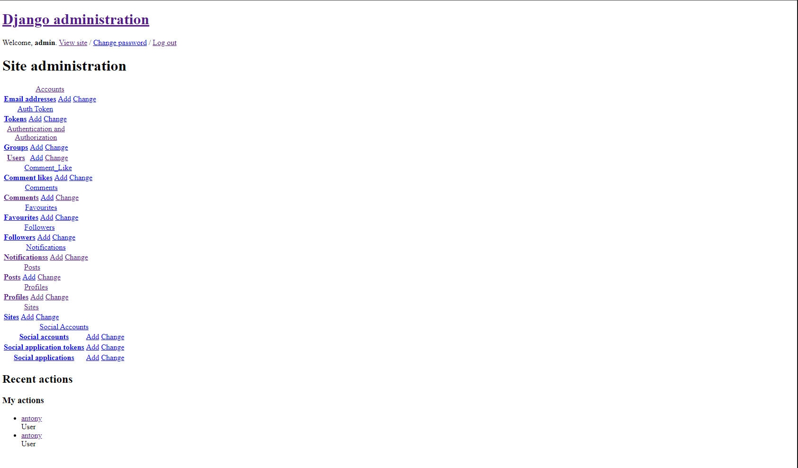

## Brick Connect API

### Testing Method

I decided to test my API manually so I could test each endpoint and add data to them to record the responses. These tests were performed using the Django Rest Framework interface.

The API has been set up to only allow unauthenticated users to browse the site and authenticated users to interact with the site and other users. Meaning signed in users can post, comment, like, favourite, follow, like a comment, receive notifications and have a profile they can customise.

## Table of Contents

- [Brick Connect API Manual Testing](#brick-connect-api-manual-testing)
  * [Testing Method](#testing-method)
  * [Likes Endpoints](#likes-endpoints)
    + [likes/](#likes-)
    + [likes/id/](#likes-id)
  * [CommentLike Endpoints](#commentlike-endpoints)
    + [CommentLike/](#commentlike)
    + [CommentLike/id/](#commentlike-id)
  * [Posts Endpoints](#posts-endpoints)
    + [posts/](#posts)
    + [posts/id/](#posts-id)
  * [Notifications Endpoints](#notifications-endpoints)
    + [notifications/](#notifications)
    + [notifications/id/](#notifications-id)
  * [Profiles Endpoints](#profiles-endpoints)
    + [profiles/](#profiles)
    + [profiles/id/](#profiles-id)
  * [Followers Endpoints](#followers-endpoints)
    + [followers/](#followers)
    + [followers/id/](#followers-id)
  * [Comments Endpoints](#comments-endpoints)
    + [comments/](#comments-)
    + [comments/id/](#comments-id)
  * [Favourites Endpoints](#favourites-endpoints)
    + [favourites/](#favourites)
    + [favourites/id/](#favourites-id)
  * [Categories Endpoints](#categories-endpoints)
    + [category/](#category)
  * [Validation](#validation)
  * [Known Bugs](#known-bugs)

### Likes Endpoints

#### likes/

The likes endpoint should display a list of likes, these likes have been made with the GET request and is available for authenticated users and unauthenticated users.

If the user is authenticated they will have the option of selecting a post from the dropdown and posting a like.

If the authenticated user tries to like the same post more then once, they will receive a 400 Bad Request error.

#### likes/id/

This endpoint is in reference to a specific id for a like. Likes can be seen by all users in list view and by id. If the like belongs to the authenticated user then they have the ability to delete the like.

As mentioned like owners can delete their likes and this would effectivly be unliking a post on the frontend.

If an invalid id is entered into the URL, then this will trigger a 404 not found error.

### CommentLike Endpoints

#### CommentLike/

The commentlike endpoint should display a list of commentlikes, these commentlikes have been made with the GET request and is available for authenticated users and unauthenticated users.

If the user is authenticated they will have the option of selecting a comment from the dropdown and posting a commentlike.

If the authenticated user tries to like the same comment more then once, they will receive a 400 Bad Request error.

#### commentlike/id/

This endpoint is in reference to a specific id for a commentlike. Commentlikes can be seen by all users in list view and by id. If the commentlike belongs to the authenticated user then they have the ability to delete the commentlike.

As mentioned commentlike owners can delete their commentlikes and this would effectivly be unliking a comment on the frontend.

If an invalid id is entered into the URL, then this will trigger a 404 not found error.

### Posts Endpoints

#### posts/

The post endpoint will call a GET request to view the post list, this will display all posts created. Authenticated and unauthenticated users can see this.

When the user is authenticated they will have the extra option of adding a post, this form will display all the fields a user and fill in to make a post.

Once the user has posted it will look like this.

Required posts fields must be filled out for the post to be posted.

#### posts/id/ 

The post detail endpoint successfully uses the GET request to get the posts for authenticated and unauthenticated users. However, the authenticated users also has the option to edit or delete their post.

Editing the post has sent a put request and has successfully changed the title and description.

The authenticated user can also delete the posts that belong to them.

If an invalid id is entered in the URL a 404 not found error will display. 

### Notifications Endpoints

#### notifications/

The notifications endpoint is strictly for authenticated users, So if a unauthenticated user tries to get access they will see a 403 forbidden error.

If the user is authenticated then a GET request is sent to retrieve all the notification related to the authenticated user profile.

#### notifications/id/

If the user is authenticated and has a notification linked with their profile, they have the ability to see the notification details and mark it a read. You can't create a notification as this is handled by Django signals.

If the notification belongs to the authenticated user then they have the option to delete the notification also.

If an invalid id is entered in the URL a 404 not found error will display. 

### Profiles Endpoints

#### profiles/

Both authenticated and unauthenticated users can view the profile list endpoint. However whether the user is authenticated or not there is not a create view for profiles as this is handled by Django signals.

#### profiles/id/

The profile detail page is retrievable but all users but only the authenticated profile owner has permission to edit the profile.

If an invalid id is entered in the URL a 404 not found error will display.

### Followers Endpoints

#### /followers

Both authenticated and unauthenticated users can see a follower list, which display an diferent profiles following different users.

If the user is authenticated they can see the follower list as well as use the form to follow another user.

If the user tries to follow the same profile more then once a 400 bad request will be displayed.

#### followers/id/

A authenticated user will have full access to the delete option for any users that they follow. This is the same as unfollowing in the front end.

If an invalid id is entered in the URL a 404 not found error will display.

### Comments Endpoints

#### comments/

Authenticated and unauthenticated users can view the comment list. This uses the GET request to get all comments.

if the user is authenticated they will have the ability to view all the comments and also use the comment form to make a comment.

Comment successfully created.

When trying to post a empty comment a 400 bad request error occurs.

#### comments/id/

If a user is authenticated or unauthenticated they can see specific comments by using the id in the URL.

If the user is authenticated they have the ability to edit and delete their own comments.

The PUT request is successful updating the comment.

If the user deletes the comment when editing and try to submit it they will get a 400 bad request.

If the user is authenticated and they own the comment, they have the ability to delete the comment.

If an invalid id is entered in the URL a 404 not found error will display.

### Favourites Endpoints

#### favourites/

The favourites endpoint should display a list of favourites, these favourites have been made with the GET request and is available for authenticated users and unauthenticated users.

If the user is authenticated they will have the option to create a favourite.

If the user tries the favourite the same post more then once, a 400 bad request error will display.

#### favourites/id/

Authenticated and unauthenticated users can view the favourites details if they enter the id. Only authenticated users can edit and delete their own favourites. 

A authenticated user can delete a favourite if the own it.

If an invalid id is entered in the URL a 404 not found error will display.

### Categories Endpoints

#### category/

The category endpoint is a relation to the post which is why it's the same. When authenticated users create a post they have to select a category in which to place their post.

## Validation

All files have been pass through the [Code Institute PEP8 Validation Tool](https://pep8ci.herokuapp.com/) with no major errors. Just cleaning up indentation and empty lines.

I only have line too long on my post model, both of these lines have been shortend once and are still to long so I've decided to leave them as they are.

## Known Bugs

* The CSS related to the deployed version of the admin panel does not process. The admin panel still works, but it's harder to navigate. This happened after a debugging session with the tutors, and they were under the impression it would return. As of submission day, it hasn't returned. The admin panel has all its styling in production, which is why this leads me to believe it's to do with Heroku.

Back to [README](/README.md)